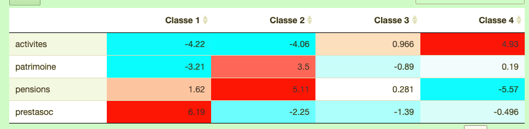

Sélection des graphiques et cartes
================
Groupe Avignon
13 January 2022

``` r
knitr::opts_chunk$set(echo = FALSE)
knitr::opts_chunk$set(message = FALSE)
knitr::opts_chunk$set(warning = FALSE)
library(readxl)
library(dplyr)
```

    ## 
    ## Attachement du package : 'dplyr'

    ## Les objets suivants sont masqués depuis 'package:stats':
    ## 
    ##     filter, lag

    ## Les objets suivants sont masqués depuis 'package:base':
    ## 
    ##     intersect, setdiff, setequal, union

``` r
library(ggplot2)
library(patchwork)
setwd("/Users/elodie/Dropbox/QESS2/Cartographie/Atelier-Analyse-spatiale")
# Table de la distribution des revenus 
disp <- read.csv("Data/FILO2018_DISP_COM.csv", sep = ";")
# Table des taux de pauvreté
pvr <- read.csv("Data/FILO2018_DISP_Pauvres_COM.csv", sep = ";")
# Table des déciles revenu
dec <- read.csv("Data/FILO2018_TRDECILES_DISP_COM.csv", sep = ";")
# Table des dec com
dec_com <- read.csv("Data/FILO2018_DEC_COM.csv", sep = ";")
# Table de la composition communale des unités urbaines
uu <- read_excel("Data/UU2020_au_01-01-2021.xlsx", sheet = 2, skip = 5)
# Extraction des communes faisant partie de l'UU Paris
uu_avignon <- uu %>%  
  filter(UU2020 == "00754" | CODGEO=="84034")
# Filtrage de la table disp
disp_avignon <- disp %>% 
  filter(CODGEO %in% uu_avignon$CODGEO)
# Filtrage de la table pvr
pvr_avignon <- pvr %>% 
  filter(CODGEO %in% uu_avignon$CODGEO)
# Filtrage de la table dec
dec_avignon <- dec %>% 
  filter(CODGEO %in% uu_avignon$CODGEO)
#FIltrage table dec com
dec_com_avignon <- dec_com %>% 
  filter(CODGEO %in% uu_avignon$CODGEO)
dec_com_avignon_mono <- dec_com_avignon %>% 
    select(CODGEO, contains("TYM5"))
# sélection des variables décrivant les ménages monoparentaux
disp_avignon_mono <- disp_avignon %>% 
    select(CODGEO, contains("TYM5"))
# sélection des variables décrivant l'ensemble des ménages
disp_avignon_ens <- disp_avignon %>% 
  select(1:30)
```

# Sujet : Les revenus des familles monoparentales

-   Comparer les familles monoparentales par rapport aux autres
    catégories de famille et par rapport à l’ensemble de la population :
    est-ce qu’il y a plus d’inégalités entre les familles monoparentales
    qu’entre les autres ? Où est-ce que les familles monoparentales
    s’installent en fonction de leur revenus ?
-   Échelle de la commune intéressant quand on est à l’échelle de
    l’unité urbaine : distribution des familles monoparentales dans la
    commune centre par rapport à la commune périphérique.

*Variables :* les variables générales : 30 première colonnes, tous les
TYMC5.

-   barplot rapport interquartiles dans les communes

Principales villes de l’unité urbaine en nombre d’habitants : Avignon,
Carpentras, Orange, Cavaillon, L’isle-sur-la-sorgue.

Principales voies d’accès à l’unité urbaine d’Avignon : aéroport
d’Avignon-Provence, TGV d’Avignon, A7 (autoroute du soleil) Le Rhône.
PNR : au sud de l’unité urbaine : 2 PNR Alpilles et Lubéron.

## Graphiques statistique descriptive


<!-- -->

<!-- -->

# Cartes

    ## Reading layer `communes-20220101' from data source 
    ##   `/Users/elodie/Dropbox/QESS2/Cartographie/communes-20220101-shp/communes-20220101.shp' 
    ##   using driver `ESRI Shapefile'
    ## Simple feature collection with 34955 features and 4 fields
    ## Geometry type: MULTIPOLYGON
    ## Dimension:     XY
    ## Bounding box:  xmin: -61.80976 ymin: -21.38973 xmax: 55.83669 ymax: 51.08899
    ## Geodetic CRS:  WGS 84

    ## Coordinate Reference System:
    ##   User input: WGS 84 
    ##   wkt:
    ## GEOGCRS["WGS 84",
    ##     DATUM["World Geodetic System 1984",
    ##         ELLIPSOID["WGS 84",6378137,298.257223563,
    ##             LENGTHUNIT["metre",1]]],
    ##     PRIMEM["Greenwich",0,
    ##         ANGLEUNIT["degree",0.0174532925199433]],
    ##     CS[ellipsoidal,2],
    ##         AXIS["latitude",north,
    ##             ORDER[1],
    ##             ANGLEUNIT["degree",0.0174532925199433]],
    ##         AXIS["longitude",east,
    ##             ORDER[2],
    ##             ANGLEUNIT["degree",0.0174532925199433]],
    ##     ID["EPSG",4326]]

    ## Coordinate Reference System:
    ##   User input: WGS 84 
    ##   wkt:
    ## GEOGCRS["WGS 84",
    ##     DATUM["World Geodetic System 1984",
    ##         ELLIPSOID["WGS 84",6378137,298.257223563,
    ##             LENGTHUNIT["metre",1]]],
    ##     PRIMEM["Greenwich",0,
    ##         ANGLEUNIT["degree",0.0174532925199433]],
    ##     CS[ellipsoidal,2],
    ##         AXIS["latitude",north,
    ##             ORDER[1],
    ##             ANGLEUNIT["degree",0.0174532925199433]],
    ##         AXIS["longitude",east,
    ##             ORDER[2],
    ##             ANGLEUNIT["degree",0.0174532925199433]],
    ##     ID["EPSG",4326]]

<!-- -->

<!-- -->

<!-- -->
<!-- -->

<!-- -->

<!-- -->

<!-- -->
